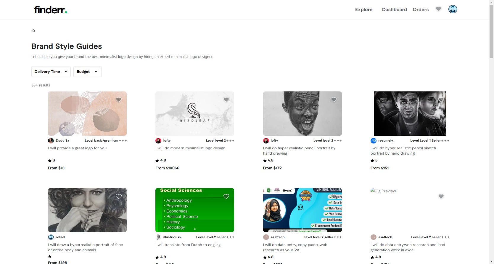

# Finderr - A open source marketplace platform

## Description:
The Gig Management project provides a platform for users to create and manage gigs, as well as add them to their wishlist. 
The system consists of a frontend (React) and a backend (Node.js/Express). 
Users can view available gigs, add their favorite gigs to the wishlist, and modify the list of gigs they own.

### Links
Frontend (React) on Render:
Frontend on Render

Backend Repository:
Backend Repository

#### Linting (ESLint)
Linting is used to maintain code quality and consistency throughout the project. We use ESLint to catch potential issues and enforce a coding style. ESLint helps in identifying problematic patterns in JavaScript code.

To run ESLint and check for issues: npm eslint .
